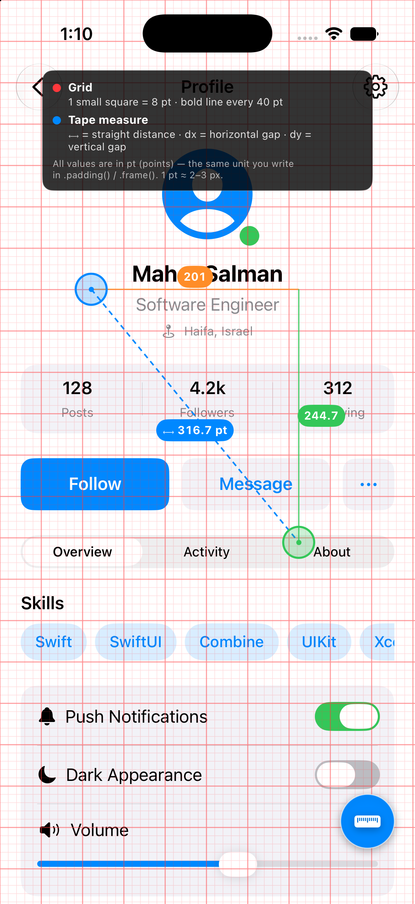
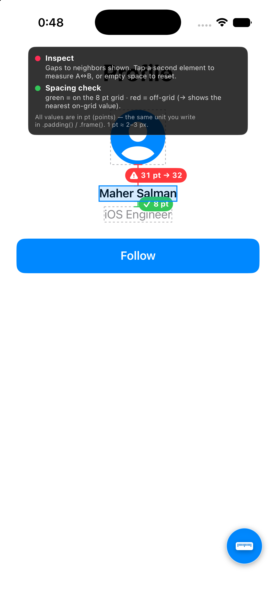
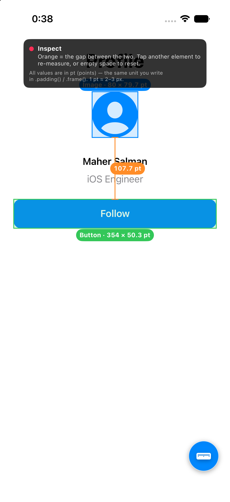
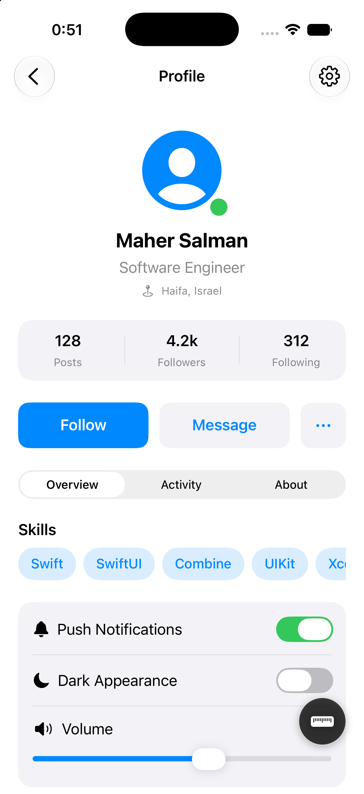

# 📏 UIDebugKit

A **drop‑in, single‑file, zero‑dependency** visual debugging overlay for SwiftUI.

Stop guessing when a designer asks *“how much space is between these two things?”*
Drop **one file** into your project, add **one line** to your root view, and
measure padding, spacing and component sizes **live in the running app** — no
Xcode View Hierarchy, no reading code, no annotations.


<p align="center">
  
</p>

---

## ✨ Features

- 🔍 **Inspect** — touch any component (no code) and see its **name + exact size**.
- 🎯 **Auto neighbor gaps** — tap one element to see the spacing to its nearest
  neighbor in **every direction** at once, just like selecting a layer in Figma.
- 📐 **Gap between two elements** — tap A, tap B, read the exact gap with a
  dimension line.
- 🚦 **Off‑grid checker** — every gap is color‑coded 🟢 on‑grid / 🔴 off‑grid
  (8 pt by default), with the nearest on‑grid value suggested.
- 📏 **Tape measure** — drag two handles to measure distance, horizontal (dx)
  and vertical (dy) spacing between any two points.
- 🔲 **Grid overlay** — configurable point grid to check alignment & rhythm.
- 🦺 **Safe area** — outlines the safe area and prints the inset values.
- 🫥 **Hide button** — tuck the floating button away for clean screenshots
  (shake to bring it back).
- 🧭 **Legend** — an on‑screen key so the numbers are never ambiguous.

All values are in **points (pt)** — the same unit you write in `.padding()` /
`.frame()`. Everything compiles to a **no‑op in Release builds**, so it’s App
Store safe.

---

## 🚀 Installation

No SPM, no CocoaPods, no setup — just copy one file:

1. Drag **[`UIDebugKit.swift`](UIDebugKit/UIDebugKit.swift)** into your Xcode project.
2. Add **one line** to your root view:

```swift
WindowGroup {
    ContentView()
        .uiDebugKit()   // 👈 that's it
}
```

3. Run on a simulator or device (Debug build). A floating **📏 button** appears
   in the bottom‑right corner — tap it to open the tools.

> Requires **iOS 15+ / SwiftUI**.

---

## 📸 Screenshots

| Inspect → neighbor gaps + grid check | Gap between two elements | Grid + tape measure |
|:---:|:---:|:---:|
|  |  |  |
| Tap an element → gaps to neighbors, with 🟢 on‑grid `✓ 8 pt` and 🔴 off‑grid `⚠ 31 pt → 32` | Tap two elements → the exact spacing between their edges | Drag two handles, or overlay the point grid |

The bundled demo app (`ContentView.swift`) is a realistic profile screen packed
with components — stats, buttons, a segmented control, chips, toggles, a slider,
a search field, list rows and a card grid — so you can try every tool:

<p align="center">
  
</p>

---

## 🛠 How to use the tools

Open the panel with the floating **📏** button, then toggle a tool:

| Tool | What to do |
|------|------------|
| **Inspect** | *Drag* a finger to size one element. *Tap* an element to see gaps to its neighbors. *Tap a second* element to measure the gap between the two. *Tap empty space* to reset. |
| **Tape measure** | Drag the two circles to the edges you care about — read `distance`, `dx` and `dy`. |
| **Grid overlay** | Shows an 8 pt (configurable) grid with bold major lines. |
| **Safe area** | Outlines the safe area and prints the inset values. |
| **Spacing check** | Flags gaps that aren’t a multiple of your base unit (red), on‑grid gaps in green. Configurable in the panel. |

---

## ⚠️ Notes

- **Release‑safe.** The public API (`.uiDebugKit()`) is wrapped in `#if DEBUG`;
  in Release it returns the view unchanged and ships **zero** overlay code.
- **Inspect is DEBUG‑only.** SwiftUI flattens its whole view tree into one UIKit
  layer, so Inspect reads the **accessibility tree** for element frames. To build
  that tree without VoiceOver running, it flips an in‑process accessibility
  switch (`_AXSSetAutomationEnabled`, a private symbol). Because the kit is
  entirely inside `#if DEBUG`, this never reaches the App Store — but Inspect
  only works in Debug builds. The other tools use **public API only**.
- **Accuracy.** Inspect is exact for text, buttons, rows and most controls;
  for images/SF Symbols it reports the visual glyph bounds, and purely
  decorative content with no accessibility info can’t be detected (use the tape
  measure for those).

---

## 📄 License

MIT — do whatever you like.
